<style>
/* @theme marpit-theme */
@import 'scaffoldTheme';
section.lead h1 {
  text-align: center;
  margin: 30px !important;
}

section.lead h2 {
  padding-top: 30px !important;
  padding-bottom: 30px !important;
}

section {
  width: 1280px;
  height: 960px;
  font-size: 40px;
  padding: 50px;
  padding-top: 30px;
  display: block;
}

h1 {
  font-size: 60px;
  color: #09c;
  padding-bottom: 0px !important;
  margin-bottom: 0px !important;
}

h2 {
  font-size: 50px;
  padding-bottom: 0px !important;
  margin-top: 0px;
  margin-bottom: 0px !important;
}

section footer {
    top: 650px;
    left: 50px;
    right: 80px;
    font-size: 24px;
    line-height: 36px;
}

section img {
    max-height: 470px;
    max-width: 100%;
}

section.center p {
    text-align: center;
    align-content: center;
}

section::after {
  bottom: 0;
  content: attr(data-marpit-pagination);
  padding: inherit;
  pointer-events: none;
  position: absolute;
  right: 0;
  top: 620px;
}

section.lead::after {
    display: none;
}

section:not([data-marpit-pagination])::after {
  display: none;
}
</style>

# Apache.JMeter в большом проекте

## Performance на каждый день

## Смирнов Вячеслав

Эксперт по тестированию Райффайзен БАНК

----------

# Цель

CI/CD для тестирования производительности:

* подавать высокую нагрузку
* автоматизировать выполнение теста
* уложиться в возможности сборочного агента

--------
<!-- 
_footer: https://habr.com/company/raiffeisenbank/blog/342126/ <br>Централизованный сontinuous deployment за год (2017-11) Максим Ефимов @WaRm
_class: center
-->

# Continuous deployment


--------
<!-- 
_footer: https://habr.com/company/raiffeisenbank/blog/350986/ <br>Централизованный сontinuous deployment за год vol 2 (2018-03) Константин Курочкин @kkurochkin

_class: center
-->

# Continuous deployment


--------
<!-- 
_footer: https://www.atlassian.com/continuous-delivery/ci-vs-ci-vs-cd <br>Continuous integration vs. continuous delivery vs. continuous deployment (2017-11) Sten Pittet

_class: center
-->
# Планируемый процесс

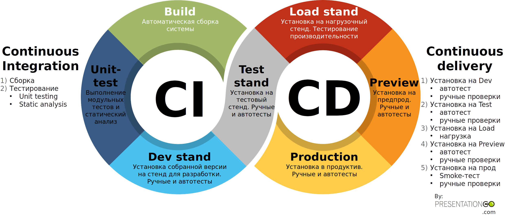

--------
<!-- _class: center -->
# Performance на каждый день

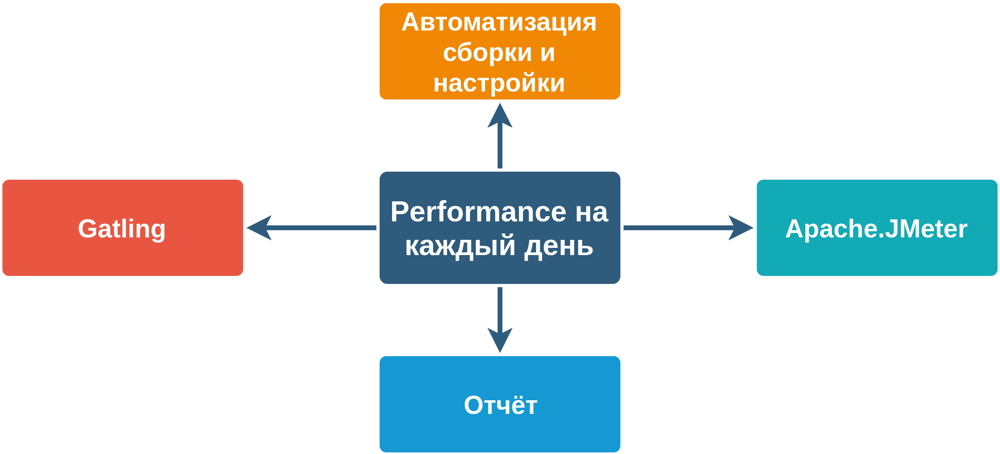

--------
<!-- _class: center -->
# Автоматизация сборки и настройки

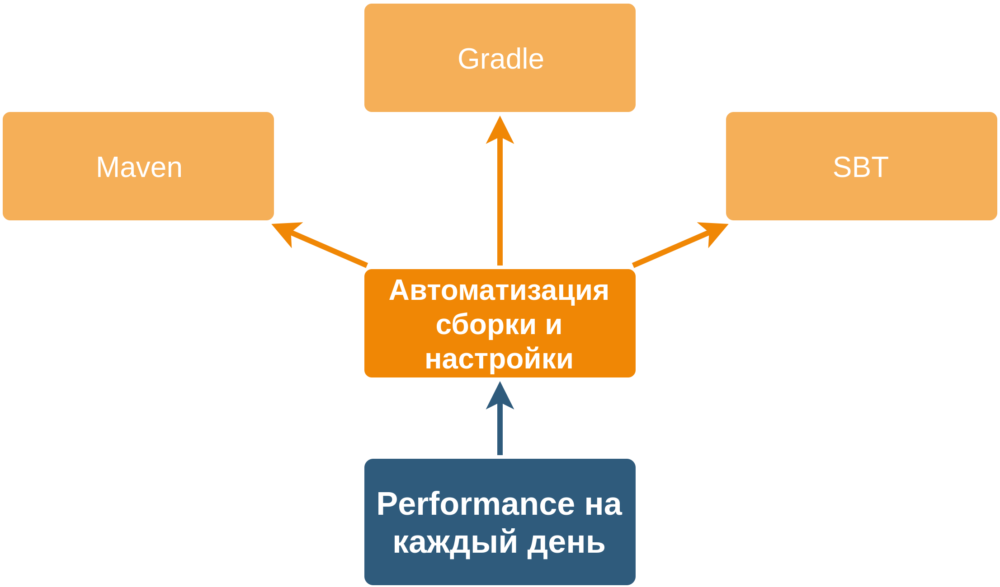

--------
# Автоматизация сборки и настройки
## Что делал

* Скрипты JMeter (без библиотек и плагинов)
* Скрипты JMeter + каталог с зависимостями
* Скрипты JMeter + jmeter-maven-plugin

-------
<!-- 
_class: center
_footer: Скрипт с плагинами
-->
<h1><strike>Автоматизация</strike> сборки и настройки</h1>

## Скрипты JMeter (без библиотек и плагинов)

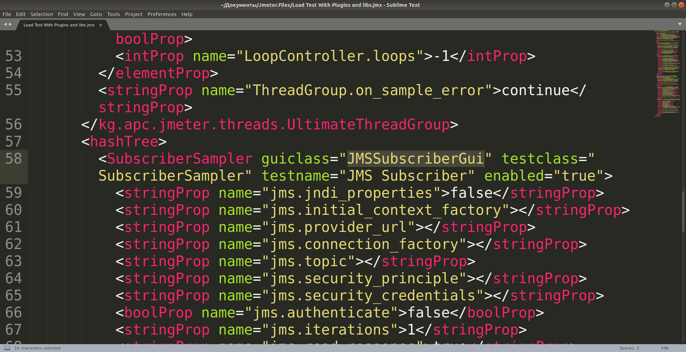

-------
<!-- 
_class: center
_footer: Отсутствующие популярные плагины можно докачать
-->
<h1><strike>Автоматизация</strike> сборки и настройки</h1>

## Скрипты JMeter (без библиотек и плагинов)

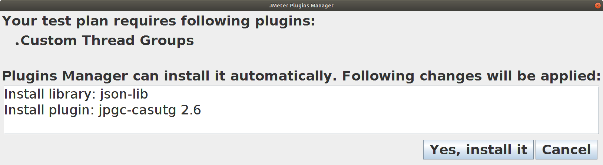

--------
<!-- _class: center -->
# Автоматизация сборки и настройки

## Скрипт JMeter + каталог с зависимостями

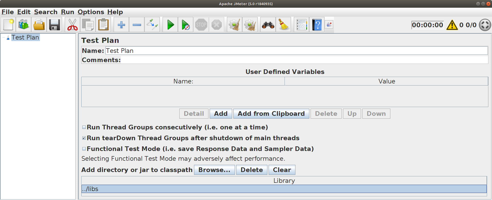

--------
<!-- _class: center -->
# Автоматизация сборки и настройки

## Скрипт JMeter + каталог с зависимостями

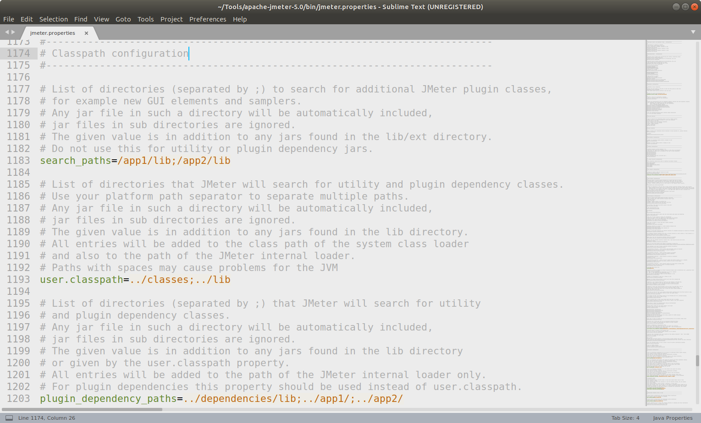


--------

# Автоматизация сборки и настройки

## Скрипт JMeter + каталог с зависимостями

* ../libs/
    * com.ibm.mq.jar
* ../plugins/
    * jpgc-casutg-2.6/
        - jmeter-plugins-casutg-2.6.jar
    * jpgc-casutg-2.6.libs/
        - jmeter-plugins-cmn-jmeter-0.4.jar

--------

# Автоматизация сборки и настройки

## Скрипт JMeter + каталог с зависимостями

* ../libs/
    * com.ibm.mq.jar **(user.classpath)**
* ../plugins/
    * jpgc-casutg-2.6/lib/ext/ **(search.paths)**
        - jmeter-plugins-casutg-2.6.jar
    * jpgc-casutg-2.6/lib/ **(plugin_dependency_paths)**
        - jmeter-plugins-cmn-jmeter-0.4.jar

--------

# Автоматизация сборки и настройки

## Скрипт JMeter + каталог с зависимостями

```
# Плагины
search.paths=../plugins/jpgc-casutg-2.6/lib/ext

# Зависимости плагинов
plugin_dependency_paths=../plugins/jpgc-casutg-2.6/lib

# Библиотеки для Groovy-скриптов (JSR-223), для невизуальных компонентов
user.classpath=../libs/com.ibm.mq-9.0.2.987123.jar;../libs/com.ibm.mqjms-9.0.2.987123.jar
```
Property-файл передаётся в JMeter при запуске скрипта
```
 -G[propertyfile]
    defines a file containing JMeter properties to be sent to all remote servers.
 -p, --propfile <argument>
    the jmeter property file to uses
```


--------
<!-- 
_footer: https://github.com/jmeter-maven-plugin/jmeter-maven-plugin <br>(2010-10 – ...) Mark Collin @Ardesco, Philippe M @pmouawad</nobr>

-->
# Автоматизация сборки и настройки

## Скрипт JMeter + jmeter-maven-plugin

```
+---+
<project>
    [...]
        <build>
            <plugins>
                <plugin>
                    <groupId>com.lazerycode.jmeter</groupId>
                    <artifactId>jmeter-maven-plugin</artifactId>
                    <version>USE LAST VERSION</version>
                    <executions>
                        <execution>
                            <id>jmeter-tests</id>
                            <goals>
                                <goal>jmeter</goal>
                            </goals>
                        </execution>
                    </executions>
                    <configuration>
                        <jmeterExtensions>
                            <artifact>kg.apc:jmeter-plugins-casutg:2.4</artifact>
                        </jmeterExtensions>
                        <!-- The plugin uses some broken dependencies. An alternative is to set this to true and use excludedArtifacts, see below  -->
                        <downloadExtensionDependencies>false</downloadExtensionDependencies>
                    </configuration>
                </plugin>
            </plugins>
        </build>
    [...]
</project>
+---+
```


--------
# Автоматизация сборки и настройки
## Что видел

* Скрипты JMeter + единый дистрибутив
* Docker-контейнеры с Apache.JMeter

-------
<!-- _class: center -->
# Автоматизация сборки и настройки
## Скрипты JMeter + единый дистрибутив

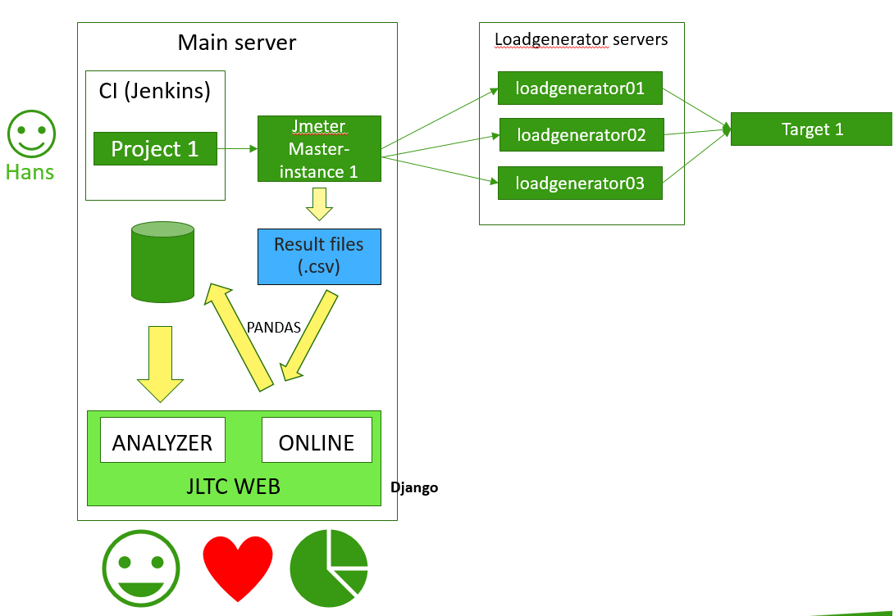

<!-- 
_footer: https://habr.com/post/342380/ <br>Нагрузочное тестирование, история автоматизации процесса (2017-11) Герман Сёмин @v0devil
-->

-------
<!-- _class: center -->
# Автоматизация сборки и настройки
## Скрипты JMeter + единый дистрибутив

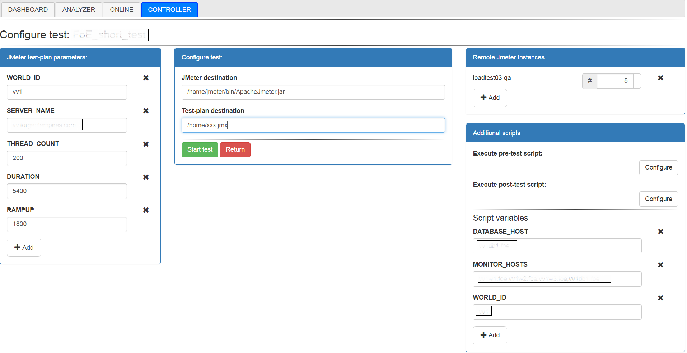

<!-- 
_footer: https://github.com/innogames/JMeter-Control-Center <br>(2016-12 – ...) German Syomin @v0devil
-->

--------
# Автоматизация сборки и настройки

## Выбрал maven

* jar-файлы в maven.org или artifactory;
* точность версий jar-файлов;
* в git только код и скрипты;
* точность настройки теста;
* простота запуска теста;
* 🤔 знание maven (xml).

--------
<!-- _class: center -->
# Инструменты подачи нагрузки

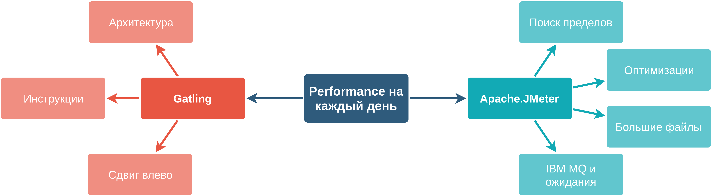

--------
<!-- _class: center -->
# Инструменты подачи нагрузки

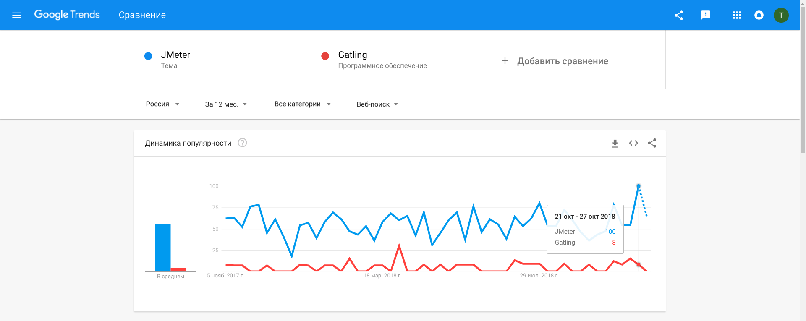
В России через Google ищут JMeter в 10 раз чаще, чем Gatling

<!-- _footer: https://trends.google.com/trends/explore?geo=RU&q=%2Fm%2F04ypch,%2Fm%2F0swkqjz -->

--------

<!-- _class: center -->
# Инструменты подачи нагрузки


---------
# Инструменты подачи нагрузки
## Поиск пределов

```
$ ./run.sh ./script.01.Thread_Group.jmx --nongui
Creating summariser <summary>
Created the tree successfully using ./script.01.Thread_Group.jmx
Starting the test @ Mon Oct 01 17:21:27 MSK 2018 (1538403687382)
Waiting for possible Shutdown/StopTestNow/Heapdump message on port 4445
summary +     19 in 00:00:02 =    7.7/s Avg:     0 Min:     0 Max:     2 Err:     0 (0.00%) Active: 1 Started: 10 Finished: 9
summary +    256 in 00:00:30 =    8.6/s Avg:     0 Min:     0 Max:    12 Err:     0 (0.00%) Active: 2 Started: 139 Finished: 137
summary =    275 in 00:00:32 =    8.5/s Avg:     0 Min:     0 Max:    12 Err:     0 (0.00%)
summary +    498 in 00:00:30 =   16.6/s Avg:     0 Min:     0 Max:     2 Err:     0 (0.00%) Active: 3 Started: 389 Finished: 386
summary =    773 in 00:01:02 =   12.4/s Avg:     0 Min:     0 Max:    12 Err:     0 (0.00%)
summary +    738 in 00:00:30 =   24.6/s Avg:     0 Min:     0 Max:    19 Err:     0 (0.00%) Active: 2 Started: 757 Finished: 755
summary =   1511 in 00:01:32 =   16.4/s Avg:     0 Min:     0 Max:    19 Err:     0 (0.00%)
summary +    976 in 00:00:30 =   32.6/s Avg:     0 Min:     0 Max:    17 Err:     0 (0.00%) Active: 2 Started: 1245 Finished: 1243
summary =   2487 in 00:02:02 =   20.3/s Avg:     0 Min:     0 Max:    19 Err:     0 (0.00%)
summary +   1214 in 00:00:30 =   40.4/s Avg:     0 Min:     0 Max:     1 Err:     0 (0.00%) Active: 4 Started: 1854 Finished: 1850
summary =   3701 in 00:02:32 =   24.3/s Avg:     0 Min:     0 Max:    19 Err:     0 (0.00%)
summary +   1454 in 00:00:30 =   48.5/s Avg:     0 Min:     0 Max:     2 Err:     0 (0.00%) Active: 3 Started: 2580 Finished: 2577
summary =   5155 in 00:03:02 =   28.3/s Avg:     0 Min:     0 Max:    19 Err:     0 (0.00%)
summary +   1684 in 00:00:30 =   56.1/s Avg:     0 Min:     0 Max:     2 Err:     0 (0.00%) Active: 8 Started: 3427 Finished: 3419
summary =   6839 in 00:03:32 =   32.2/s Avg:     0 Min:     0 Max:    19 Err:     0 (0.00%)
summary +    488 in 00:00:30 =   16.1/s Avg:     2 Min:     0 Max:   361 Err:     0 (0.00%) Active: 155 Started: 3818 Finished: 3663
summary =   7327 in 00:04:03 =   30.2/s Avg:     0 Min:     0 Max:   361 Err:     0 (0.00%)
java.lang.OutOfMemoryError: Java heap space
Dumping heap to java_pid21386.hprof ...
Heap dump file created [2723488978 bytes in 41,828 secs]
Killed
```

---------
# Инструменты подачи нагрузки
## Поиск пределов

Мониторинг java-процесса:
* оперативная память `memory_rss`, `memory_swap` и `memory_stack`
* процессор `cpu_usage`
* количество потоков `num_threads`

telegraf:
* inputs.procstat: `pattern: "java.+/ApacheJMeter"`

---------
# Инструменты подачи нагрузки
## Оптимизации

* `[-]` Debug Sampler
* `[-]` Thread Group, Generate Parent Sampler
* `[-]` XPath Extractor
* `[+]` nonGuiMode
* `[+]` Regular Expression Extractor
* создавать минимальное количество потоков


---------
<!-- _class: center -->

# Инструменты подачи нагрузки
## Оптимизации

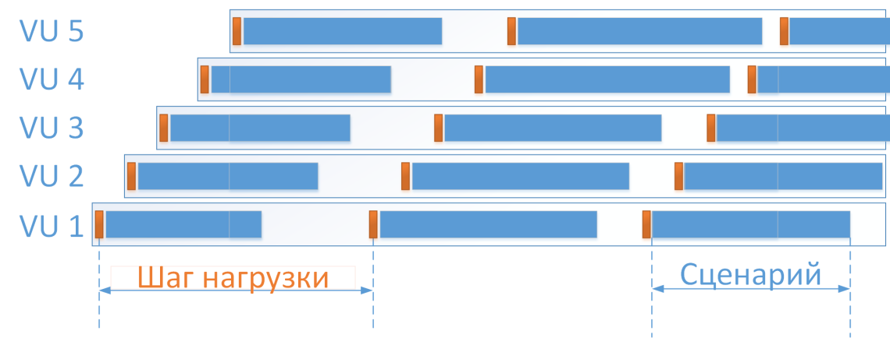

<!-- _footer: https://loadtestweb.wordpress.com/2017/08/23/pacing/ -->

---------
<!-- _class: center -->

# Инструменты подачи нагрузки
## Оптимизации

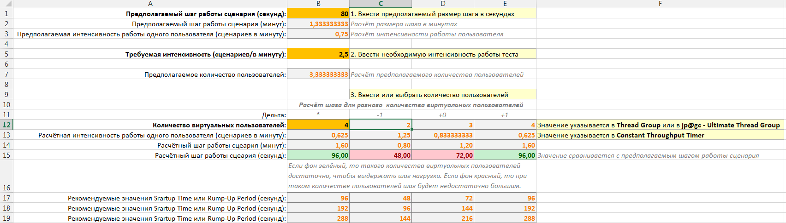

<!-- _footer: https://loadtestweb.wordpress.com/2017/08/23/pacing/ -->

---------
<!-- _class: center -->

# Инструменты подачи нагрузки
## Оптимизации

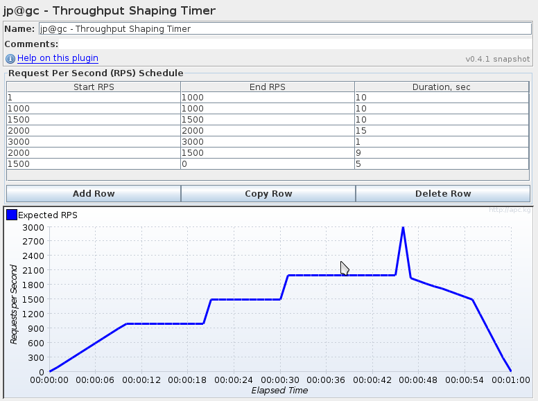

<!-- _footer: https://jmeter-plugins.org/wiki/ThroughputShapingTimer/ -->

--------
<!-- _class: center -->

# Инструменты подачи нагрузки
## Большие файлы

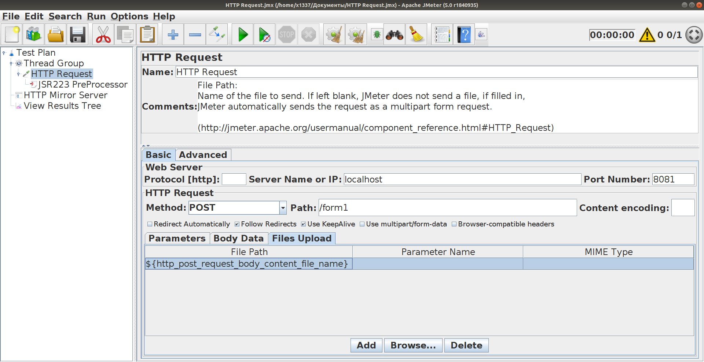

<!-- _footer: http://jmeter.apache.org/usermanual/component_reference.html#HTTP_Request -->

--------
<!-- _class: center -->

# Инструменты подачи нагрузки
## Большие файлы

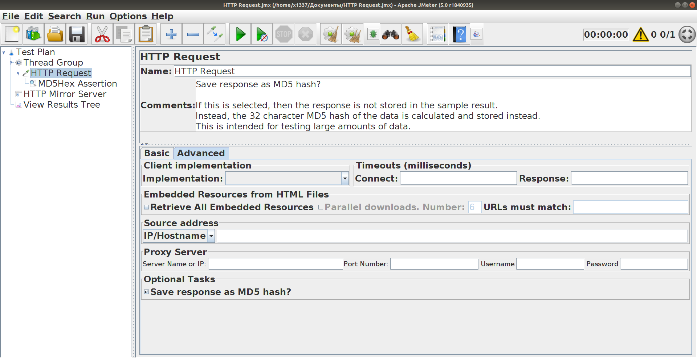

<!-- _footer: http://jmeter.apache.org/usermanual/component_reference.html#HTTP_Request -->

---------

# Инструменты подачи нагрузки
## IBM MQ и ожидания

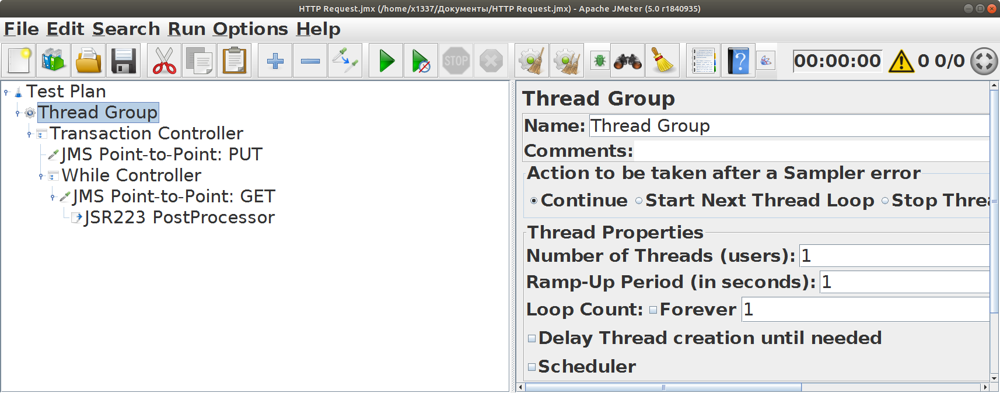

<!-- _footer: http://jmeter.apache.org/usermanual/component_reference.html#JMS_Point-to-Point -->

---------

# Инструменты подачи нагрузки
## IBM MQ и ожидания: SharedHashMap

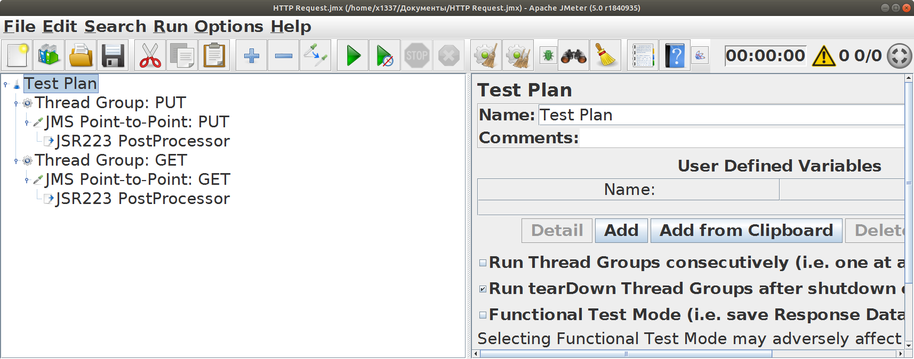

<!-- _footer: https://docs.oracle.com/javase/8/docs/api/java/util/concurrent/ConcurrentHashMap.html -->

---------

# Инструменты подачи нагрузки
## IBM MQ и ожидания: SharedHashMap

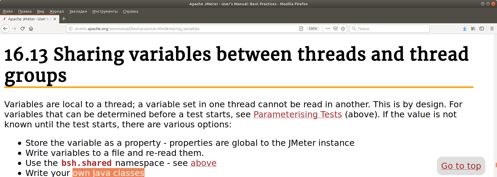

<!-- _footer: http://jmeter.apache.org/usermanual/best-practices.html#sharing_variables -->

---------

# Инструменты подачи нагрузки
## Gatling

Архитектура:

* Scala
* Akka
* Netty

<!-- _footer: http://gatling.io/ -->

---------

# Инструменты подачи нагрузки
## Gatling

Инструкции:

* https://gatling.io/documentation/
* https://habr.com/company/tinkoff/blog/344818/ *
* https://gatling.io/docs/current/extensions/maven_archetype/

<!-- _footer: http://gatling.io/ -->

---------
<!-- _class: center -->
# Инструменты подачи нагрузки
## Gatling: Сдвиг влево

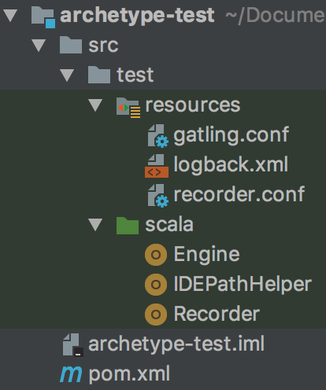

<!-- _footer: http://gatling.io/ -->

--------
<!-- _class: center -->
# Отчётность

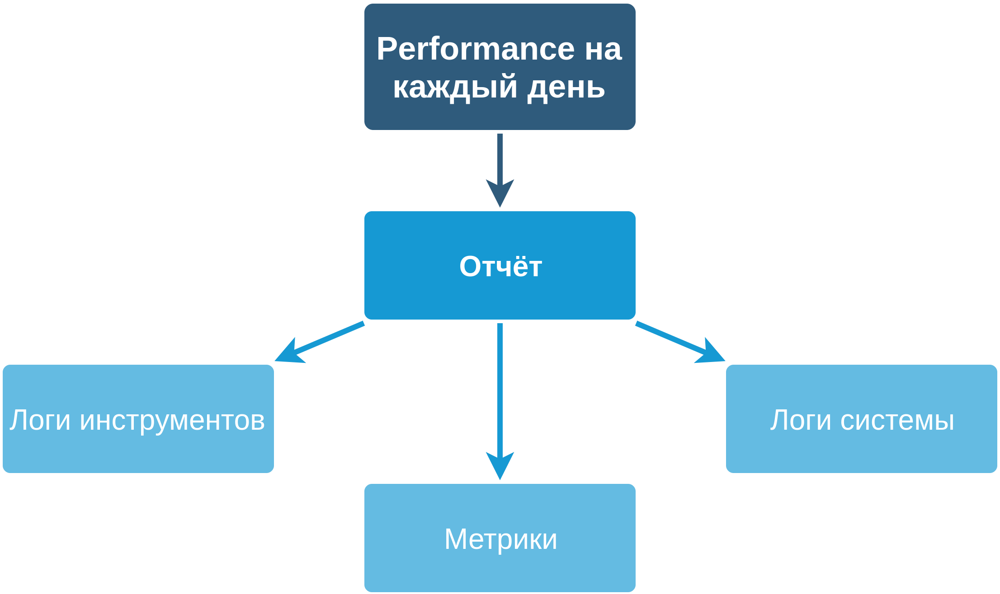

--------
<!-- _class: center -->
# Отчётность
## Логи инструментов

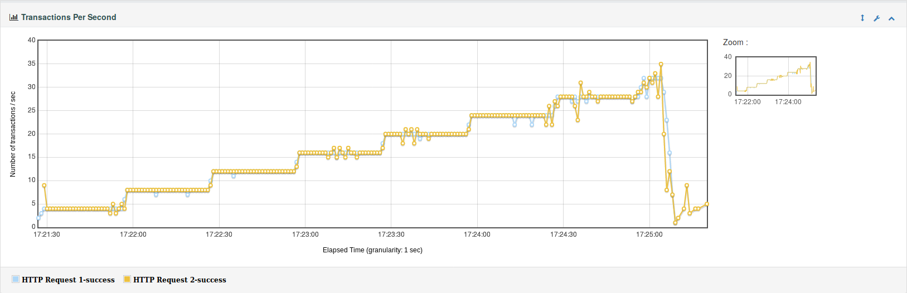

--------
<!-- _class: center -->
# Отчётность
## Логи инструментов

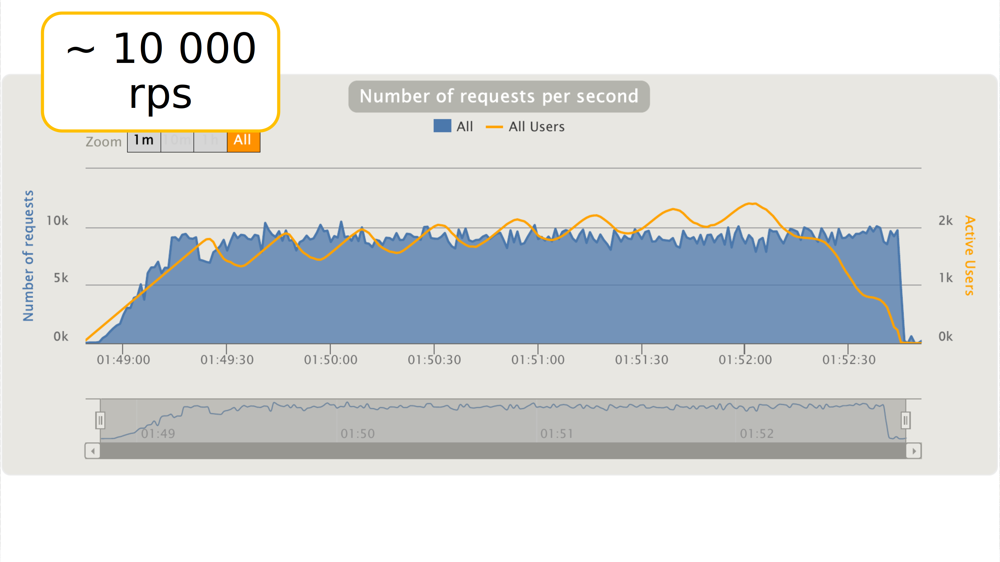

--------
<!-- _class: center -->
# Отчётность
## Метрики

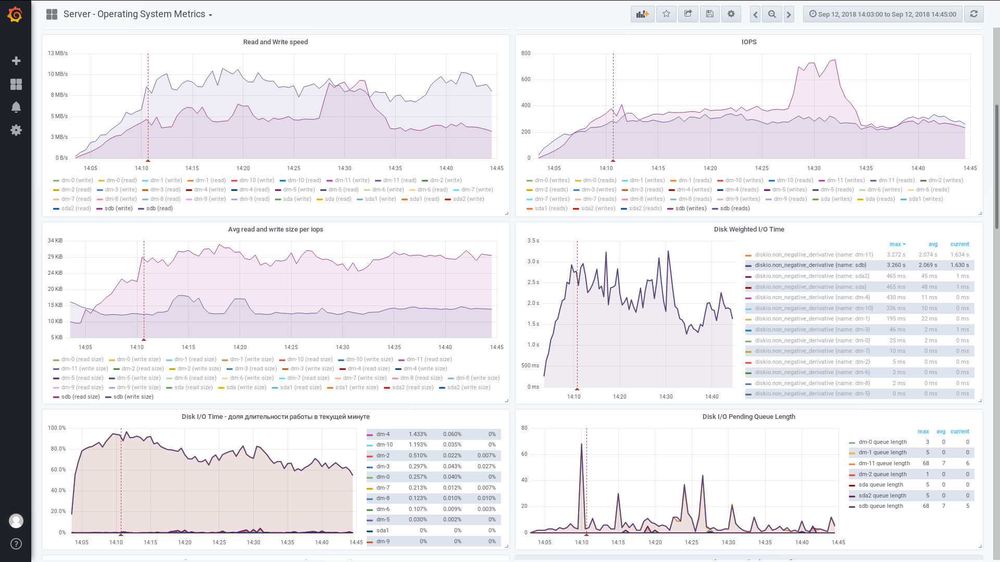

--------
<!-- _class: center -->
# Отчётность
## Метрики

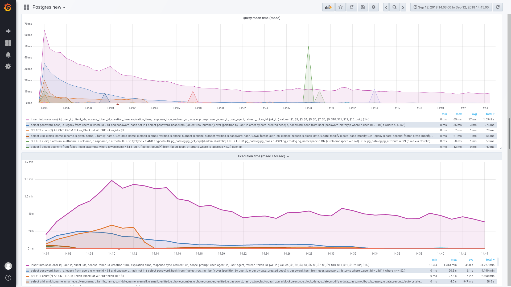

<!-- _footer: https://github.com/influxdata/telegraf/issues/3497 - [influxdata/telegraf] PostgreSQL extensible Parse error when specifying tagvalue="query" for pg_stat_statements (#3497) -->

--------
<!-- _class: center -->
# Отчётность
## Метрики


<!-- _footer: https://github.com/influxdata/telegraf/issues/3497 - [influxdata/telegraf] PostgreSQL extensible Parse error when specifying tagvalue="query" for pg_stat_statements (#3497) -->

--------
<!-- _class: center -->
# Отчётность
## Логи системы

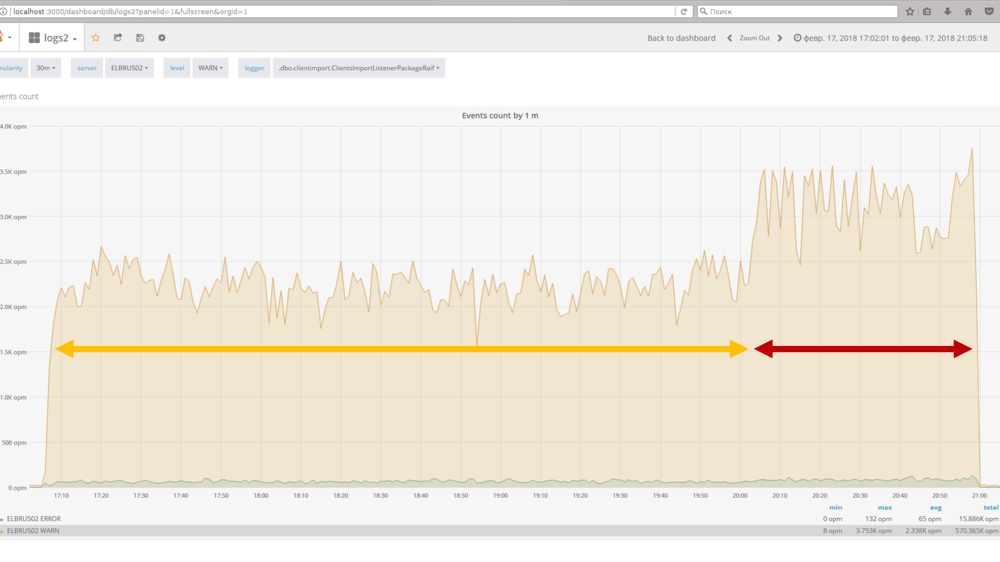

--------


<!-- _class: center -->
# Performance на каждый день

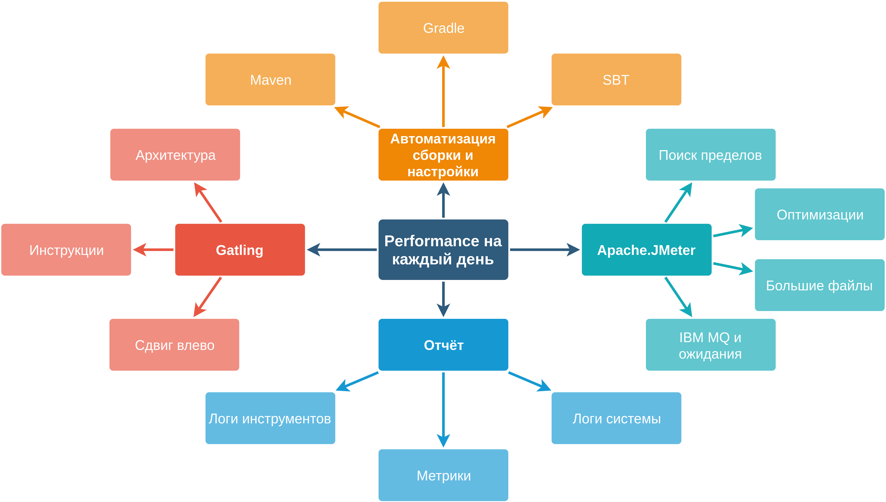

----

# Спасибо

## Apache.JMeter в большом проекте

#### Performance на каждый день

#### Смирнов Вячеслав

Эксперт по тестированию Райффайзен БАНК
